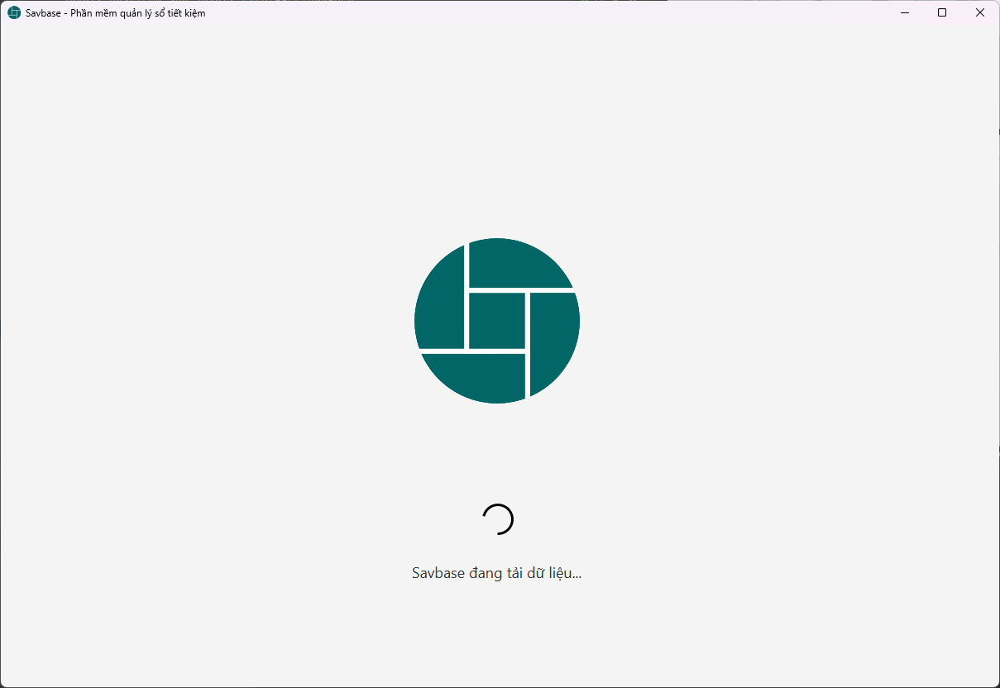
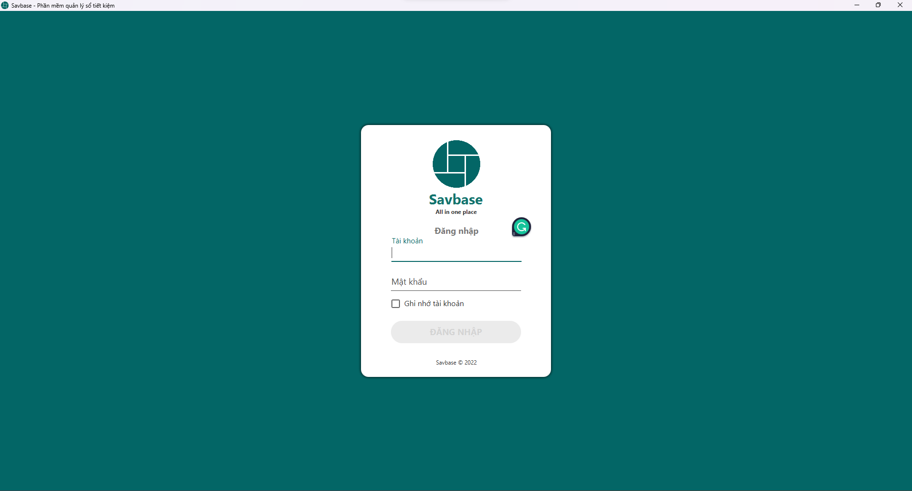
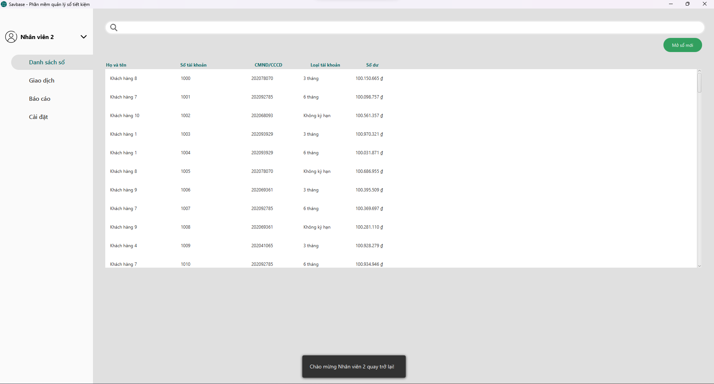
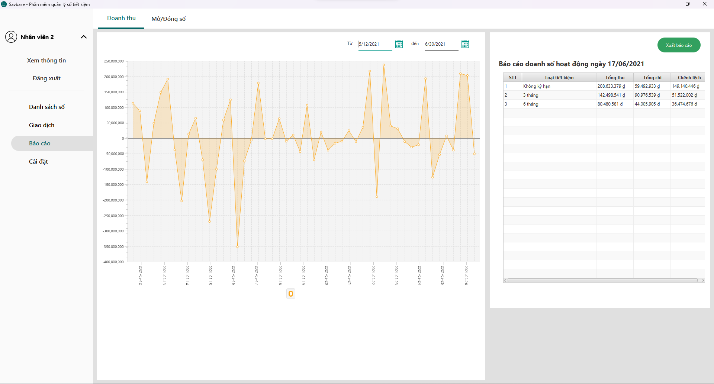
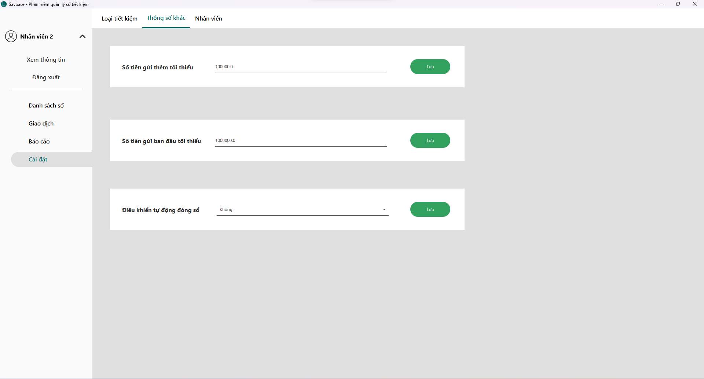
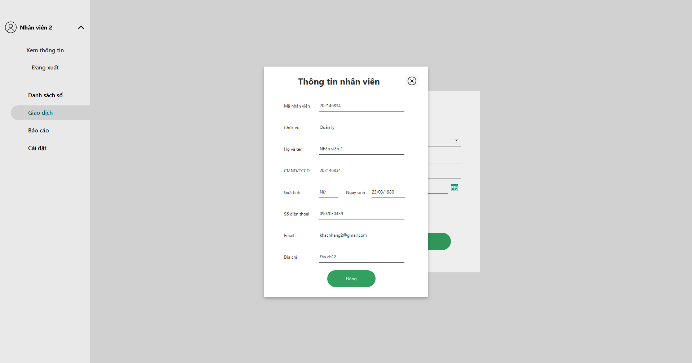

# Savbase


A Saving accounts management application

## Features

- Create, view detail of savings account
- Make a deposit or withdrawal
- View dashboard
- Security


## Tech Stack

**Client:** JavaFX

**Server:** SQL Server

**UI Library:** [JFoenix](https://github.com/sshahine/JFoenix), [MaterialFX](https://mvnrepository.com/artifact/io.github.palexdev/materialfx/11.13.5)


## Installation

- Install Prerequisites
    - [Java SE Development Kit 16](https://www.oracle.com/java/technologies/javase/jdk16-archive-downloads.html)
    - [Gradle 5.6.4](https://gradle.org/releases/)
    - [IntelliJ IDEA]()
    - [Scene Builder]()
    - [JavaFX SDK 18](https://gluonhq.com/products/javafx/)
    - [SQL Server Express 2019](https://www.microsoft.com/en-us/download/details.aspx?id=101064)
- Go to  **File** -> **Settings...** -> **Build, Execution, Deployment** -> **Build Tools** -> **Gradle** -> Check if Gradle JVM is set to *Project SDK (16)*
- Open [**src/main/javaMain.java**](src/main/java/Main.java) to get default *Run/Debug Configuration*
- **Edit Configuration** -> **Modify options** -> **Add VM options** -> Then add below text to your VM options
````bash
--module-path
"package\javafx-sdk-18.0.1\lib"
--add-modules
javafx.controls,javafx.fxml
--add-modules=javafx.base
--add-modules=javafx.controls
--add-modules=javafx.fxml
--add-modules=javafx.graphics
--add-modules=javafx.media
--add-modules=javafx.swing
--add-modules=javafx.web
--add-opens
javafx.base/com.sun.javafx.runtime=ALL-UNNAMED
--add-opens
javafx.controls/com.sun.javafx.scene.control.behavior=ALL-UNNAMED
--add-opens
javafx.controls/com.sun.javafx.scene.control=ALL-UNNAMED
--add-opens
javafx.base/com.sun.javafx.binding=ALL-UNNAMED
--add-opens
javafx.base/com.sun.javafx.event=ALL-UNNAMED
--add-opens
javafx.graphics/com.sun.javafx.stage=ALL-UNNAMED
--illegal-access=warn
````
- Run file [Savebase SQL](Savbase.sql) to get application test data
- Update connection string in [db.properties](db.properties) file
- Congrats! You're all set. Let's run the application.
## Authors

- [Dương Bình Trọng](https://www.github.com/princ3od)
- [Phạm Đức Hoàng](https://github.com/PRID021)
- [Nguyễn Cao Cường](https://github.com/feelings93)
- [Đinh Việt Hào](https://github.com/HaoDinh9999)
## Screenshots
<p align="center">
 
 
 
 
 
 

</p>
